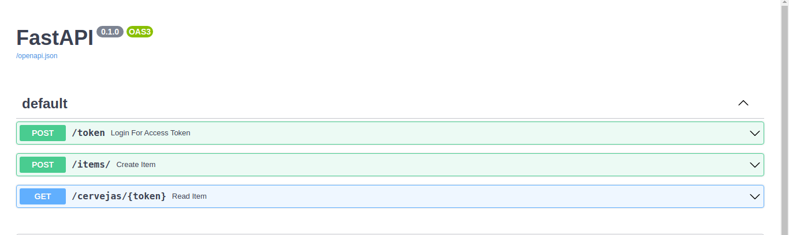

# API - BOREAL
> Meu nome é Lucas Soares Pessini e estou perticipando do Processo Seletivo da Empresa Boreal Fintech Data Driven. Para executar esse programa é nescessário que tenha instalado o docker-compose versão 1.29.2 e também que as portas 80 e 81 liberadas.


## Inicializando o Programa

Executa o comando abaixo no diretório onde está o projeto baixado:

```sh
docker-compose up -d
```

Depois acessa o seguinte link http://127.0.0.1/docs#/ onde verica os endpoints que foram desenvolvidos.

<p align="center">
  
</p>

Lembrando que o código principal está em app/main.py.


## Endpoints Desenvolvidos

Foram desenvolvidos 3 endpoints:

### Primeiro Endpoint

Autenticação com OAuth2, protegendo todas as rotas, gerando token, que expira a cada hora, e o token deve ser utilizado em todos os endpoints.

```sh
docker exec -it myfastapi  curl -X 'POST' \
  'http://127.0.0.1/token' \
  -H 'accept: application/json' \
  -H 'Content-Type: application/x-www-form-urlencoded' \
  -d 'grant_type=&username=admin&password=admin&scope=&client_id=&client_secret='
```
Aqui pode verificar que ele retorna o token.


### Segundo Endpoint

Endpoint com request method POST, com payload: User (Str), Order (Float), PreviousOrder (Boolean), retornando um JSON com a RESPONSE 200 e os items do payload. 

```sh
docker exec -it myfastapi  curl -X 'POST' \
  'http://127.0.0.1/items/' \
  -H 'accept: application/json' \
  -H 'Content-Type: application/json' \
  -d '{
  "User": "Usuario 1",
  "Order": 0.001,
  "PreviousOrder": true,
  "token": "TOKEN"
}'
```
Aqui tem que lembrar que tem que utilizar o TOKEN que vem do retorno do primeiro endpoint.


### Terceiro Endpoint

Endpoint com request method GET, buscando dados da API OpenBreweries (https://api.openbrewerydb.org/breweries/), mostrando no resultado apenas um dicionário com os nomes das cervejas que estarão em uma lista.


```sh
docker exec -it myfastapi curl -X 'GET' \
  'http://127.0.0.1/cervejas/TOKEN' \
  -H 'accept: application/json'
```
Aqui tem que lembrar que tem que utilizar o TOKEN que vem do retorno do primeiro endpoint.

## Para Ver Novas Modificações do Código

O código está presente em app/main.py. Caso seja alterado esse código e queira ver as novas modificações, salve o novo código em app/main.py e depois executa o seguinte comando.

```sh
docker exec -it myfastapi uvicorn app.main:app --host 0.0.0.0 --port 81 --reload
```
E as novas modificações serão acessadas na seguinte pagina http://127.0.0.1:81/docs#/.